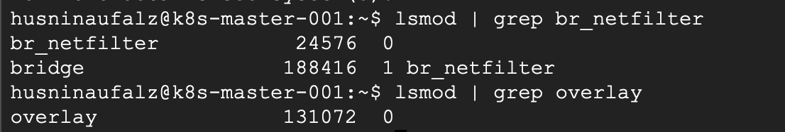

# How to setup simple Kubernetes Cluster with GCE

## Chapter 1: Introduction

As an Site Reliability Engineer in the modern software company, I can’t never keep my hand from tinkering and operating Kubernetes clusters. If you’re a junior like me, you’ll mostly doing operation task with Kubernetes like creating new deployment, make sure configmap variable values are correct, or investigating why this CRD is not working. I rarely have an opportunity to deploy a kubernetes cluster from beginning. So in this article I want to show you how I deploy my own staging kubernetes cluster.

We’ll start with the tools needed to spin up a minimal Kubernetes cluster. I will deploy a Kubernetes cluster in Google Cloud Platform using Compute Engine Instances. More or less we need these resources in Google Compute Engine:

1. A VPC with at least one subnet.
2. A Public IP address for control plane node.
3. One Router and one NAT in the same region.
4. Several security groups.
5. An Instance template.
6. One Compute Engine as control plane node.
7. Two Compute Engine as regular nodes.

## Chapter 2: Prepare Infrastructure Resources

To setup the infrastructure resources, we’ll use `terrafrom` and `terragrunt` as our Infrastructure as Code tool. You can see the code repository in [here](./infrastructure).

## Chapter 3: Bootstrap Kubernetes Cluster

Let’s start with your control plane or master node.

1. Check if the MAC address is available with this command
    
    ```bash
    ip link
    ifconfig -a
    ```
    
2. Check product ID with this command 
    
    ```bash
    sudo cat /sys/class/dmi/id/product_uuid
    ```
    
3. (Optional) Check available ports with command `nc`. If no `nc` is installed, please install it with the command `sudo apt install netcut`.
4.  Install Container Runtime. For **container.d** on D**ebian**, use this command [1]
    
    ```bash
    # Add Docker's official GPG key:
    sudo apt-get update
    sudo apt-get install ca-certificates curl gnupg gpg -y
    sudo install -m 0755 -d /etc/apt/keyrings
    curl -fsSL https://download.docker.com/linux/debian/gpg | sudo gpg --dearmor -o /etc/apt/keyrings/docker.gpg
    sudo chmod a+r /etc/apt/keyrings/docker.gpg
    
    # Add the repository to Apt sources:
    echo \
      "deb [arch="$(dpkg --print-architecture)" signed-by=/etc/apt/keyrings/docker.gpg] https://download.docker.com/linux/debian \
      "$(. /etc/os-release && echo "$VERSION_CODENAME")" stable" | \
      sudo tee /etc/apt/sources.list.d/docker.list > /dev/null
    sudo apt-get update
    sudo apt-get install containerd.io -y
    ```
    
5. Install `kubeadm, kubectl, and kubelet`. For Debian
    
    ```bash
    # Get kubernetes stable v1.28
    curl -fsSL https://pkgs.k8s.io/core:/stable:/v1.28/deb/Release.key | sudo gpg --dearmor -o /etc/apt/keyrings/kubernetes-apt-keyring.gpg
    
    # This overwrites any existing configuration in /etc/apt/sources.list.d/kubernetes.list
    echo 'deb [signed-by=/etc/apt/keyrings/kubernetes-apt-keyring.gpg] https://pkgs.k8s.io/core:/stable:/v1.28/deb/ /' | sudo tee /etc/apt/sources.list.d/kubernetes.list
    
    sudo apt-get update
    sudo apt-get install -y kubelet kubeadm kubectl
    sudo apt-mark hold kubelet kubeadm kubectl
    ```
    
6. Set IpTables [2]
    
    ```bash
    cat <<EOF | sudo tee /etc/modules-load.d/k8s.conf
    overlay
    br_netfilter
    EOF
    
    sudo modprobe overlay
    sudo modprobe br_netfilter
    
    # sysctl params required by setup, params persist across reboots
    cat <<EOF | sudo tee /etc/sysctl.d/k8s.conf
    net.bridge.bridge-nf-call-iptables  = 1
    net.bridge.bridge-nf-call-ip6tables = 1
    net.ipv4.ip_forward                 = 1
    EOF
    
    # Apply sysctl params without reboot
    sudo sysctl --system
    ```
    
7. Verify the net_filter and overlay. The result will be like this
    
    
    
    ```bash
    lsmod | grep br_netfilter
    lsmod | grep overlay
    ```
    
8. Verify the system variables
    
    ```bash
    sudo sysctl \
    net.bridge.bridge-nf-call-iptables \
    net.bridge.bridge-nf-call-ip6tables \
    net.ipv4.ip_forward
    ```
    
9. Check the cgroup that is used in the node
    
    ```bash
    ps -p 1
    # Result. This node use systemd
    # PID TTY          TIME CMD
    # 1 ?        00:00:01 systemd
    ```
    
10. Configure cgroup for systems driver and restart containerd [3]
    
    ```bash
    cat <<EOT | sudo tee /etc/containerd/config.toml
    [plugins."io.containerd.grpc.v1.cri".containerd.runtimes.runc]
      [plugins."io.containerd.grpc.v1.cri".containerd.runtimes.runc.options]
        SystemdCgroup = true
    EOT
    sudo systemctl restart containerd
    ```
    
11. Do steps 1 - 10 for all nodes.
12. Bootstrap Cluster in the master node. Save the join command in the last line of stdout [4]
    
    ```bash
    export INT_IP_ADDR="CONTROL_PLANE_INTERNAL_IP"
    export EXT_IP_ADDR="CONTROL_PLANE_EXTERNAL_IP"
    export POD_CIDR="10.244.0.0/16"
    
    sudo kubeadm init \
    --apiserver-cert-extra-sans=$EXT_IP_ADDR \
    --apiserver-advertise-address $INT_IP_ADDR \
    --pod-network-cidr=$POD_CIDR
    ```
    
13. Setup kubeconfig after cluster bootstrap finished
    
    ```bash
    mkdir -p $HOME/.kube
    sudo cp -i /etc/kubernetes/admin.conf $HOME/.kube/config
    sudo chown $(id -u):$(id -g) $HOME/.kube/config
    ```
    
14. Install Cilium or Weave-Net (Deprecated) as CNI
    1. Install Weave-Net (Deprecated) [5]
        
        ```bash
        kubectl apply -f https://github.com/weaveworks/weave/releases/download/v2.8.1/weave-daemonset-k8s.yaml
        ```
        
        1. Update the IP_ALLOC environment variable in weavenet daemon set the same as pod network cidr [6]
            
            ```bash
            containers:
            	- name: weave
            		env:
            			- name: IPALLOC_RANGE
            				value: 10.244.0.0/16
            ```
            
        2. Join the node with our master node. The command is in step 12
            
            ```bash
            sudo kubeadm join 11.1.0.30:6443 --token o7fohi.f9j4ixw4l0d41tfw \
                    --discovery-token-ca-cert-hash sha256:02cf70f456300a8ce33946a6ce74d340e956ee3bfb00ad33eae867de96de5fea
            ```
            
    2. Install Cilium with helm
        1. Make sure linux kernel version is `>= 4.9.17`
            
            ```bash
            uname -r
            ```
            
        2. Taint master node
            
            ```bash
            kubectl taint nodes k8s-master-001 node.cilium.io/agent-not-ready=true:NoExecute
            ```
            
        3. Install Helm
            
            ```bash
            curl -fsSL -o get_helm.sh https://raw.githubusercontent.com/helm/helm/main/scripts/get-helm-3
            chmod 700 get_helm.sh
            ./get_helm.sh
            ```
            
        4. Add Cilium repository and Install Cilium CRD
            
            ```bash
            helm repo add cilium https://helm.cilium.io/
            helm install cilium cilium/cilium --version 1.15.1 --namespace kube-system
            ```
            
        5. Install Cilium CLI
            
            ```bash
            CILIUM_CLI_VERSION=$(curl -s https://raw.githubusercontent.com/cilium/cilium-cli/main/stable.txt)
            CLI_ARCH=amd64
            if [ "$(uname -m)" = "aarch64" ]; then CLI_ARCH=arm64; fi
            curl -L --fail --remote-name-all https://github.com/cilium/cilium-cli/releases/download/${CILIUM_CLI_VERSION}/cilium-linux-${CLI_ARCH}.tar.gz{,.sha256sum}
            sha256sum --check cilium-linux-${CLI_ARCH}.tar.gz.sha256sum
            sudo tar xzvfC cilium-linux-${CLI_ARCH}.tar.gz /usr/local/bin
            rm cilium-linux-${CLI_ARCH}.tar.gz{,.sha256sum}
            ```
            
        6. (Optional) Restart unmanaged pods
            
            ```bash
            kubectl get pods --all-namespaces -o custom-columns=NAMESPACE:.metadata.namespace,NAME:.metadata.name,HOSTNETWORK:.spec.hostNetwork --no-headers=true | grep '<none>' | awk '{print "-n "$1" "$2}' | xargs -L 1 -r kubectl delete pod
            ```
            
        7. Start verification process
            
            ```bash
            cilium status
            cilium connectivity test
            ```
            
        8. Join the node with our master node. The command is in step 12
            
            ```bash
            sudo kubeadm join 11.1.0.30:6443 --token o7fohi.f9j4ixw4l0d41tfw \
                    --discovery-token-ca-cert-hash sha256:02cf70f456300a8ce33946a6ce74d340e956ee3bfb00ad33eae867de96de5fea
            ```
            
15. Your kubernetes cluster is ready 🥳

## Chapter 4: Access the Kubernetes Cluster

After you kubernetes cluster is ready, you can get your kubeconfig file in `~/.kube/config` file. Copy that config file and you can access your kubernetes cluster from you local device.

## References

[1] [Install using the apt repository | Docker Docs](https://docs.docker.com/engine/install/debian/#install-using-the-repository)

[2] [Forwarding IPv4 and letting iptables see bridged traffic](https://kubernetes.io/docs/setup/production-environment/container-runtimes/#forwarding-ipv4-and-letting-iptables-see-bridged-traffic)

[3] [Configuring the systemd cgroup driver](https://kubernetes.io/docs/setup/production-environment/container-runtimes/#forwarding-ipv4-and-letting-iptables-see-bridged-traffic)

[4] [Initializing your control-plane node](https://kubernetes.io/docs/setup/production-environment/tools/kubeadm/create-cluster-kubeadm/#initializing-your-control-plane-node)

[5] [Weave Kubernetes Addon](https://www.weave.works/docs/net/latest/kubernetes/kube-addon/)

[6] [Installing Weave](https://www.weave.works/docs/net/latest/install/installing-weave)

[7] [Taint Effects](https://docs.cilium.io/en/stable/installation/taints/#taint-effects)

[8] [Installation Using Helm](https://docs.cilium.io/en/stable/installation/k8s-install-helm/)
