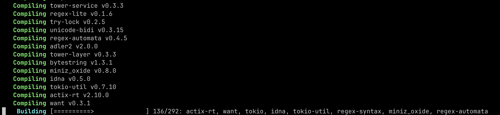

# Migrate my portfolio website from actix-web to axum
## 🤔 Why?

I started to take care of my portfolio project again after abandoning it for 2 months. My main reason is that I want to make something that has real usage (even though I don't have real traffic right away). One of the reasons is that I want to write codes.


During the brainstorming phase, I want to have a feature to pull data from my github repository. I have a [husni-blog-resources](https://github.com/husni-zuhdi/husni-blog-resources) repository consisting of my writing about technical stuff (mostly related to Infrastructure as a Code and Site Reliability Engineering). In this website, I have a `Blogs` page to show my blog. I don't want to waste my time copy-paste my articles. So, why not create a feature to pull all my writings from that repo and render them on my portfolio website? That seems doable.

I found [Octocrab](https://github.com/XAMPPRocky/octocrab/tree/main) Github API Client for Rust that was created by [XAMPPRocky](https://github.com/XAMPPRocky) (Thanks for creating such an amazing project 🙏). Then I noticed during the build process, this library used `hyper` and `tower` libraries. Both libraries are under the [tokio](https://tokio.rs) ecosystem, an async runtime for Rust.

In the previous version, I used the `actix-web` web framework since it was easy to learn and quite straightforward. I tried to learn `tokio` before and tbh, as a self-learner programmer, it was a steep learning curve to tackle and I don't have any reason to learn that hard if there is a more easy option to choose. However, after seeing the Octocrab library, I want to implement it on my portfolio website. If I use `actix` and `tokio` at the same time it seems (and turns out to become) inefficient. Why do I need two async runtime? Nobody needs that many async runtime.

So in this release of the [husni-porfolio](https://github.com/husni-zuhdi/husni-portfolio) website, I want to use `octocrab` and move to [axum](https://github.com/tokio-rs/axum), one of the lightweight web frameworks powered by `tokio`.

## ✍ Process

The migration process is quite simple as my portfolio website is quite simple since `actix` and `axum` use similar concepts. The first thing is to install `axum` by adding these lines to the `Cargo.toml`

```toml
axum = "0.7.5"
tokio = { version = "1.0", features = ["full"] }
tower = { version = "0.4", features = ["util"] }
tower-http = { version = "0.5.0", features = ["fs", "trace"] }
```

Under the `cmd` folder, I need to change the async runtime in the `main.rs` file from `actix` to `axum`. The first time I tried to build my application after migrating all of the source codes, I forgot to update this async runtime and keep me puzzled about *why does actix still compiled after I removed it from the dependencies list?*. Sometimes you just forget the most obvious thing.

```rust
// actix
#[actix_web::main]
async fn main() -> std::io::Result<()> {
...
}

// axum
#[tokio::main]
async fn main() -> std::io::Result<()> {
...
}
```

Then in the `internal` folder, I need to change my handler and routing functions to suit the `axum` specification. The structure of my `internal` library can be simplified into something like this:
- `router.rs` is where all of my router functions are located. They render HTML with [askama](https://github.com/djc/askama) and do additional processing.
- `handler.rs` process config, load blogs data, setup state data, configure routing, and running HTTP server.

Changes in `router.rs` are quite simple as we only need to change function parameter types and return types while the inner mechanism of each function stays relatively the same. For example, in the below snippet of the `get_blog` function, I change the types of `path` and `blogs_data` parameters also with the return type. Other than that I only added pattern matching to handle errors and edge cases.

```rust
// actix
pub async fn get_blog(
    path: web::Path<String>,
    blogs_data: web::Data<BlogsData>,
) -> Result<impl Responder> {
    let blog_id = path.into_inner();
    let blog_data = blogs_data
        .blogs
        .iter()
        .filter(|blog| blog.id == blog_id)
        .next()
        .expect("Failed to get blog name with id {blog_id}");

    let blog = Blog {
        id: &blog_id,
        name: &blog_data.name,
        filename: &blog_data.filename,
        body: &blog_data.body,
    }
    .render()
    .expect("Failed to render blog.html");
    Ok(Html(blog))
}

// axum
pub async fn get_blog(Path(path): Path<String>, State(app_state): State<AppState>) -> Html<String> {
    let state = app_state
        .blogs_data
        .blogs
        .iter()
        .filter(|blog| &blog.id == &path)
        .next();
    debug!("BlogData: {:?}", &state);

    match state {
        Some(_) => {}
        None => {
            warn!(
                "Failed to get blog with ID {}. Retunre 404 Not Found",
                &path
            );
            return get_404_not_found().await;
        }
    }

    let blog_data = state.unwrap();
    let blog = Blog {
        id: path.clone().as_str(),
        name: &blog_data.name,
        filename: &blog_data.filename,
        body: &blog_data.body,
    }
    .render();

    match blog {
        Ok(res) => {
            info!("Blog ID {} askama template rendered.", &path);
            Html(res)
        }
        Err(err) => {
            error!("Failed to render blog.html. {}", err);
            get_500_internal_server_error()
        }
    }
}
```

For the `handler.rs` function, most of the changes are on how to serve the HTTP server. In `actix` you can use `actix_web::HttpServer` to spin up the new HTTP server while in `axum` the equal step is to use `axum::Router`. To configure the service routing, I prefer the way `axum` handles it because it looks a lot cleaner than `actix_web`. I also add a fallback function to default any not-routed endpoint to the `get_404_not_found` function.

Two things that I see as big differences are how `axum` handles state and static file(s). In `actix` I can serve multiple states to be shared between routes but in `axum` you can only share one state type (but you can create [substates](https://docs.rs/axum/latest/axum/extract/struct.State.html#substates)). Tbh, it's not a big problem for me (at least for now) since I only do read operations from the state.

To handle static files (like CSS, images, and icons) I used to create a dedicated function that utilizes `actix_files`. But in `axum` I tried to do the same thing but was unable to find an easy way. In the end, I read the documentation of `tower_http` that adds an additional feature to serve a static file in the `tokio` ecosystem. I used `tower_http::ServerFile` and `tower_http::ServerDir` as a nested service to serve all of my static files.

```rust
// actix
HttpServer::new(move || {
	App::new()
		.wrap(middleware::Logger::default())
		.app_data(web::Data::new(blogs_data.clone()))
		.app_data(web::Data::new(config.clone()))
		.service(web::resource("/").route(web::get().to(profile)))
		.service(web::resource("/statics/{static_file}").route(web::get().to(statics)))
		.service(web::resource("/blogs").route(web::get().to(get_blogs)))
		.service(web::resource("/blogs/{blogid}").route(web::get().to(get_blog)))
		.service(web::resource("/version").route(web::get().to(get_version)))
		.service(web::resource("/not-found").route(web::get().to(get_404_not_found)))
})
.bind((endpoint, port))
.expect("Failed to start Http Server")
.run()
.await

// axum
let app = Router::new()
	.route("/", get(get_profile))
	.route("/not-found", get(get_404_not_found))
	.route("/version", get(get_version))
	.route("/blogs", get(get_blogs))
	.route("/blogs/:blog_id", get(get_blog))
	.nest_service("/statics", get_service(ServeDir::new("./statics/favicon/")))
	.nest_service(
		"/statics/styles.css",
		get_service(ServeFile::new("./statics/styles.css")),
	)
	.with_state(app_state)
	.fallback(get(get_404_not_found));

let listener = tokio::net::TcpListener::bind(endpoint).await.unwrap();
axum::serve(listener, app).await.unwrap();
```
## ✅ Conclusion

In conclusion, the migration process is quite straightforward and not difficult. With this web framework migration, I can trim my dependencies count from `292` to `218`.




The build duration also decreased by `40s` from `2m 28s` to `1m 49s`.


Aside from all the upsides I write above, the only bug I encountered after migrating to `axum` is there is a blink appearing during a transition from one page to another. It's just a minor bug and I'll be working on that later.


I'll share my migration story from the application performance side later. Please wait for the next blog. Thanks for reading.
