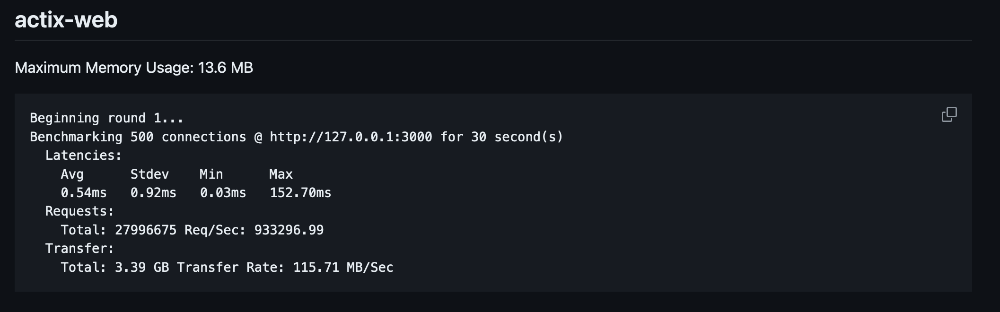
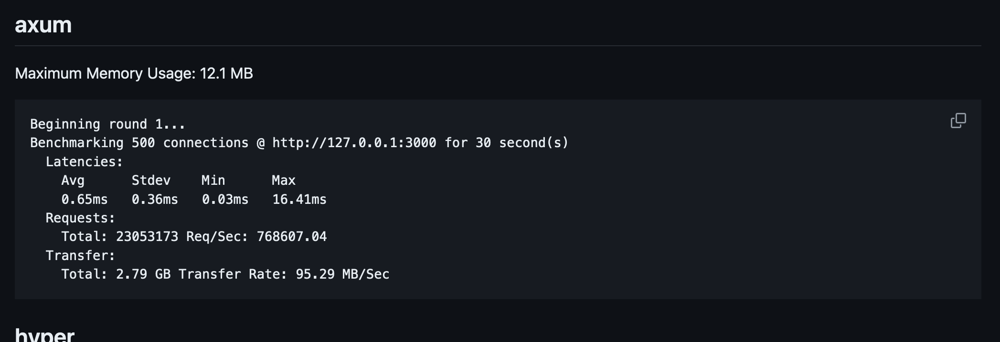
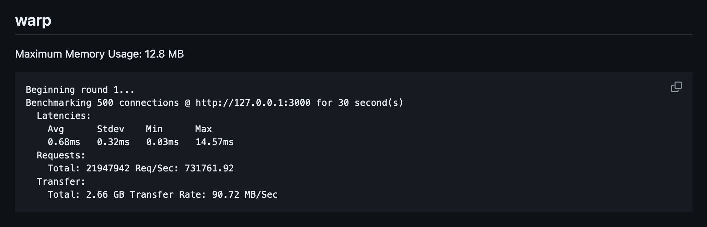
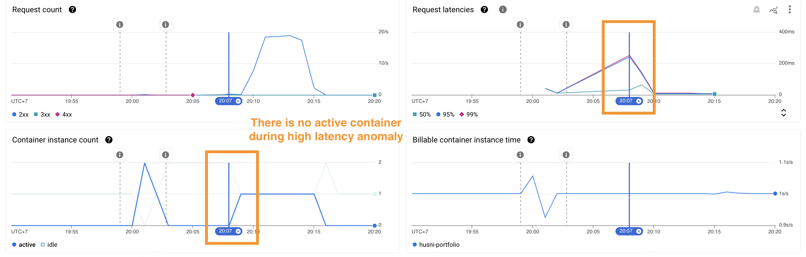

# Effect of web framework migration on my portfolio website performance
## ⛰ Background

In my previous blog about portfolio website migration ([github](https://github.com/husni-zuhdi/husni-blog-resources/tree/main/003-migrate-my-portfolio-website-from-actix-web-to-axum) or [portfolio](https://husni-zuhdi.com/blogs/003-g)) I shared my web framework migration process. It was a smooth process to migrate from `actix-web` to the `axum` web framework. I also describe the reasons for the migration which are:
- Trimming `husni-portfolio` dependencies
- Increase website performance

We already trimmed dependencies from `292` to `218`. Now let's see the pros and cons related to performance. The first step to check is benchmarks. I followed [Web Frameworks Benchmark](https://web-frameworks-benchmark.netlify.app/result?asc=0&l=rust) and [Rust Web Benchmark](https://github.com/programatik29/rust-web-benchmarks/blob/master/result/hello-world.md) as references.

From the first website, I can find facts that:
- `actix` wins on throughput than `axum` or [warp](https://github.com/seanmonstar/warp) (another tokio-based web framework). On Request per Second 512 (*I don't know what 512 stands for*) `actix` got `620.690rps`, `warp` got `585.641rps`, and `axum` got `537.279rps`.
- On p99 latency, `warp` leads on `4.83ms` followed by `axum` on `5.31ms` then for `actix` it's `8.58ms`. The p90 gives the same result.

From the second website, I found this nice comparison:
- `actix-web` has high throughput but high max latency. 
- `axum` is more moderate RPS, has quite a low max latency (based on my gut feeling), and has the lowest max memory usage. 
- `warp` has the lowest max latency among these three but also the lowest throughput. 

I want my portfolio website to be fast and lightweight. I don't expect to have a huge request coming to my website except for ThePrimagen to read my blogs or someone DDOS my website. So moderate throughput and low latency are good to have. I also don't want my website to be memory-hungry since I want to press my infra cost as much as possible. Low memory usage is nice to have. Last, I choose `axum` instead of `warp` because `axum` has a more mature ecosystem with twice the Github Stargazer on their repo.

## 🏃‍♂️ Measure the performance

To measure my portfolio website performance, I use [postman](https://www.postman.com/) and [cloud run](https://cloud.google.com/run) metrics dashboard. *Postman is an API platform for building and using APIs. Postman simplifies each step of the API lifecycle and streamlines collaboration so you can create better APIs—faster*. It's a `curl` wrapper with testing, automation, and collaboration features. While *Cloud Run is a managed compute platform that lets you run containers directly on top of Google's scalable infrastructure*. I chose to use Cloud Run because it's the cheapest option for running a container application. If I need to scale my applications, I might migrate all of my containers to Kubernetes.

I created a [postman collection](https://github.com/husni-zuhdi/husni-portfolio/blob/main/husni_portfolio.postman_collection.json)  to execute `Run` that will call my portfolio website endpoints:
- `/` Home
- `/blogs` Blogs
- `/blogs/001` Blog 001
- `/version` Version
- `/not-found` Not Found

```json
{
	"info": {
		"_postman_id": "70376775-4806-4ed9-8f10-a15a1ed903c0",
		"name": "husni_portfolio",
		"description": "Repo: [https://github.com/husni-zuhdi/husni-portfolio](https://github.com/husni-zuhdi/husni-portfolio)",
		"schema": "https://schema.getpostman.com/json/collection/v2.1.0/collection.json",
		"_exporter_id": "19888478"
	},
	"item": [
		{
			"name": "Home",
			"request": {
				"method": "GET",
				"header": [],
				"url": {
					"raw": "https://{{URL}}",
					"protocol": "https",
					"host": [
						"{{URL}}"
					]
				}
			},
			"response": []
		},
		{
			"name": "Blogs",
			"request": {
				"method": "GET",
				"header": [],
				"url": {
					"raw": "https://{{URL}}/blogs",
					"protocol": "https",
					"host": [
						"{{URL}}"
					],
					"path": [
						"blogs"
					]
				}
			},
			"response": []
		},
		{
			"name": "Blog 001",
			"request": {
				"method": "GET",
				"header": [],
				"url": {
					"raw": "https://{{URL}}/blogs/{{BLOG_ID}}",
					"protocol": "https",
					"host": [
						"{{URL}}"
					],
					"path": [
						"blogs",
						"{{BLOG_ID}}"
					]
				}
			},
			"response": []
		},
		{
			"name": "Version",
			"request": {
				"method": "GET",
				"header": [],
				"url": {
					"raw": "https://{{URL}}/version",
					"protocol": "https",
					"host": [
						"{{URL}}"
					],
					"path": [
						"version"
					]
				}
			},
			"response": []
		},
		{
			"name": "404 Not Found",
			"request": {
				"method": "GET",
				"header": [],
				"url": {
					"raw": "https://{{URL}}/not-found",
					"protocol": "https",
					"host": [
						"{{URL}}"
					],
					"path": [
						"not-found"
					]
				}
			},
			"response": []
		}
	],
	"event": [
		{
			"listen": "prerequest",
			"script": {
				"type": "text/javascript",
				"packages": {},
				"exec": [
					""
				]
			}
		},
		{
			"listen": "test",
			"script": {
				"type": "text/javascript",
				"packages": {},
				"exec": [
					""
				]
			}
		}
	],
	"variable": [
		{
			"key": "URL",
			"value": "localhost:8080",
			"type": "string"
		},
		{
			"key": "BLOG_ID",
			"value": "001",
			"type": "string"
		}
	]
}
```

To execute the `Run` you need to update the postman collection variables `URL` and `BLOG_ID`. The postman collection `Run` was executed in my workstation and iterated over 1000 endpoint calls and returned `duration` to complete a Run and `average response time` from all endpoints in a Run.

During the postman `Run` execution I watched the Cloud Run metrics dashboard from the GCP console. The metrics that I watched are:
- `Request count` to measure throughput in requests per second (rps).
- `Request latencies` to measure average website latencies in 99% percentile (p99), 95% percentile (p95), and 50% percentile (p50).
- `p99 Container CPU utilization` to measure the 99% percentile of container CPU utilization.
- `p99 Container Memory utilization` to measure the 99% percentile of container CPU utilization.
- `Max Send bytes` to measure the maximum bytes send through the internet.

In the Cloud Run configuration, I set the CPU Limit and Request to `0.1m` and `0.08m`. For Memory Limit and Request I set both values to `128Mi`. Those values are the lowest resource configuration allowed for a Cloud Run service. You can read it further in the Cloud Run documentation about [CPU Limit](https://cloud.google.com/run/docs/configuring/services/cpu#cpu-memory) and [Minimum Memory Limit](https://cloud.google.com/run/docs/configuring/services/memory-limits#memory-minimum)
We are going to compare test results between the pre-migration version to the post-migration version.

## ⏱ Result

Here is the *first* test result (P for postman, CR for cloud run)

| Metric                    | Control<br>(actix-web) | Test #1<br>(axum) | Difference | My facial expression         |
| ------------------------- | ---------------------- | ----------------- | ---------- | ---------------------------- |
| (P) Duration              | 8m 39s                 | 4m 27s            | -48.5%     | 😁                           |
| (P) Average Response Time | 93ms                   | 43s               | -53.7%     | 😁                           |
| (CR) Request Count        | 11.32rps               | 18.67rps          | +64.9%     | 🤩                           |
| (CR) Request Latency p99  | 141.46ms               | 252.92ms          | +78.7%     | 😧 wtf                       |
| (CR) Request Latency p90  | 55.35ms                | 242.7ms           | +338.4%    | 😭 WTF?                      |
| (CR) Request Latency p50  | 5.38ms                 | 64.22ms           | +1093.6%   | 😱 WTF??!!!                  |
| (CR) CPU Utilization p99  | 12.99%                 | 32.98%            | +153.9%    | 😢 what happened to latency? |
| (CR) CPU Memory p99       | 10.99%                 | 19.98%            | +81.8%     | 😢 what happened to latency? |
| (CR) Max Send Bytes       | 124.24k/s              | 209.85k/s         | +68%       | 😢 what happened to latency? |

Based on the `My facial expression` column you can imagine my feeling on the test result above. I didn't expect to have such high latencies after migrating to `axum` and here we are. This latency anomaly kept me puzzled for quite some time. Then after checking all config and data, I choose to do the second test. Here is the result

| Metric                    | Control<br>(actix-web) | Test #2<br>(axum) | Difference | My facial expression |
| ------------------------- | ---------------------- | ----------------- | ---------- | -------------------- |
| (P) Duration              | 8m 39s                 | 5m 04s            | -41.4%     | 🙏 please be good    |
| (P) Average Response Time | 93ms                   | 50s               | -46.2%     | 🙏 please be good    |
| (CR) Request Count        | 11.32rps               | 18.1rps           | +59.9%     | 🙏 please be good    |
| (CR) Request Latency p99  | 141.46ms               | 9.97ms            | -93.0%     | 🤩                   |
| (CR) Request Latency p90  | 55.35ms                | 9.57ms            | -82.7%     | 🤩                   |
| (CR) Request Latency p50  | 5.38ms                 | 5.04ms            | -6.3%      | 🤩                   |
| (CR) CPU Utilization p99  | 12.99%                 | 21.99%            | +69.3%     | 🤩                   |
| (CR) CPU Memory p99       | 10.99%                 | 10.99%            | -          | 🤩                   |
| (CR) Max Send Bytes       | 124.24k/s              | 197.38k/s         | +58.9%     | 🤩                   |

Now I know that the issue is not on the application side. It's either on infrastructure or my testing methodology. So I traced back my cloud run [terragrunt](https://terragrunt.gruntwork.io/) manifest in my private repo to the actual applied infrastructure configuration in Google Cloud Console. But I can't find anything suspicious. Then I checked my Cloud Run metrics dashboard again because the `[P] Average Response Time` value with any latencies values doesn't match. There must be something wrong with the metrics dashboard, I presume. Then I found this.



Turns out, during the high latencies event there is no active container in Cloud Run. I suspect that the high latencies were attributed to the container startup time. These high latencies also happened outside the performance test time range as you can see in the Request count metric panel above. The test started between `20:08-20:09` but the high latency event happened a minute before the test. We can learn two things at least from this finding

*"Never test once. At minimum test twice.*

*Double-check the result data."*

Husni Zuhdi

## ✅ Conclusion

I learned so many things during this migration and performance testing. As a Site Reliability Engineer, I never have a first hand to test my application from scratch. The migration effort was also worth doing as the performance results are good. Improvement of `Request Count` 59.9% increase and  `p99 Request Latency` 93.0% decrease are all I need. The next thing I want to improve is the infrastructure side. I'll post a new blog on how I optimize my portfolio website Cloud Run service cost to near $0. Please wait for the next blog. Thanks for reading.
