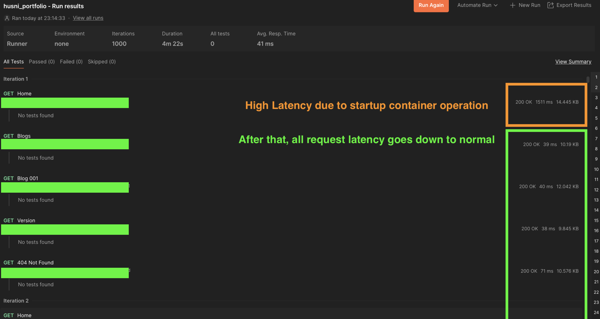

# Optimize Cloud Run configuration for my portfolio website
## 😕 What's wrong?

After migrating my portfolio website and being satisfied with the performance of my previous blog ([github](https://github.com/husni-zuhdi/husni-blog-resources/tree/main/004-effect-of-web-framework-migration-on-my-portfolio-website-performance) or [portfolio](https://husni-zuhdi.com/blogs/004-g)), I started searching for other things I could optimize from the infrastructure side. This time my goal is to **reduce the infrastructure cost as much as possible**. For control data, we'll use the cloud run cost in the past 10 days before the web framework migration (11 August 2024 - 21 August 2024) with resource configuration CPU Limit, CPU Request, and Memory Limit+Request  set to `0.1m`, `0.08m`, and `128Mi`. I mentioned it in my previous blog, but that resource configuration is the lowest Cloud Run allowed.


Based on the image above, running a container for 10 days with the lowest resource configuration cost me $1. In a year it'll cost me around $36 per container or IDR 565.000 (USD 1 = IDR 15.000). With the additional cost of domain renewal that cost me IDR 180.000 per year the total cost to run my portfolio website is IDR 745.000/year or `IDR 62.083/month`. That's about the same cost for a Basic tier Netflix subscription!


So in the spirit of saving infrastructure costs for better usage (not Netflix of course), let's start our journey to optimize the Cloud Run cost.

## 🔧 Optimization

Let's start with the details of the Cloud Run cost data before the migration. Drill down into the detail, we can see the top cost contributor of Cloud Run cost come from:
- Idle Min-Instance CPU Allocation Time (tier 2) that costs $0.5 per 10 days.
- Idle Min-Instance Memory Allocation Time (tier 2) that costs $0.44 per 10 days.


Looks like with the default Cloud Run configuration, I set the Minimum Idle Container active and keep my Cloud Run billing running. Upon further checking of [Cloud Run terragrunt module](https://github.com/GoogleCloudPlatform/terraform-google-cloud-run/blob/v0.9.1/modules/secure-cloud-run-core/variables.tf#L307-L311) that I use, the default Minimum Idle Container was set to 1. Let's change it to 0 and run the Postman performance test.

```hcl
	// pre-migration
	max_scale_instances = 2
	min_scale_instances = 1
	
	// post-migration
	max_scale_instances = 2
	min_scale_instances = 0
```

I ran the postman collection `Run` in my workstation and iterated over 1000 endpoint calls. We'll use the `average response time` from all endpoints from this Run.

From the Cloud Run metrics dashboard, I watched these metrics:
- `Request count` to measure throughput in requests per second (rps).
- `Request latencies` to measure average website latencies in 99% percentile (p99), 95% percentile (p95), and 50% percentile (p50).
- `Max Billable Container Instance Time` to measure the maximum billable time in seconds of running/active/idle container(s).
- `Container Startup Latency` to measure the time needed to start the container.

## 🚄 Result

Here is the test result (P for postman, CR for cloud run)

| Metric                                    | Control  | Test Performance | Difference | Test Infra | Difference | Difference between test |
| ----------------------------------------- | -------- | ---------------- | ---------- | ---------- | ---------- | ----------------------- |
| (P) Average Response Time                 | 93ms     | 50ms             | -46.2%     | 41ms       | -55.9%     | -9.7%                   |
| (CR) Request Count                        | 11.32rps | 18.1rps          | +59.9%     | 19.62rps   | +73.3%     | +13.4%                  |
| (CR) Request Latency p99                  | 141.46ms | 9.97ms           | -93.0%     | 9.9ms      | -93.0%     | 0%                      |
| (CR) Request Latency p90                  | 55.35ms  | 9.57ms           | -82.7%     | 9.5ms      | -82.8%     | -0.1%                   |
| (CR) Request Latency p50                  | 5.38ms   | 5.04ms           | -6.3%      | 5ms        | -7.1%      | -0.8%                   |
| (CR) Max Billable Container Instance Time | 1.001s/s | 1.001s/s         | 0%         | 0.9s/s     | -10.1%     | -10.1%                  |
| (CR) Container Startup Latency            | -        | -                | -          | 1.2901s    | +1.2901s   | +1.2901s                |

Above I added the `Test Performance` column and its `Difference` from the previous blog ([github]() or [portfolio]()) so we can compare it with the pre-migration portfolio website and post-migration portfolio website before Cloud Run optimization. From the postman `Average Response Time` and Cloud Run `Request Count` we get the better value after the optimization. There are not much difference on the latencies side but since the idle container was removed, it added latency called `Container Startup Latency` that took 1.2901s. This latency only shows up in the first request during the postman `Run` as we can see in the image below. 



Now let's talk about the `Max Billable Container Instance Time` metric. From the optimization, we can reduce this metric by `10.1%` or theoretically reduce the Cloud Run monthly cost from $3 to $2.7 if the container always runs at peak. But that is not the daily case, instead most of the time the container will be downscaled to 0 as there is not much traffic to my portfolio website. So we can compare the trend of the `Max Billable Container Instance Time` metric pre-migration and post-optimization. In pre-migration, at least one container is always idle to serve the incoming traffic. However, in the post-optimization configuration, I don't have any idle containers hence my cost when there is no traffic is $0. Since I'm willing to sacrifice availability for cost reduction, this is a big win!


Looking back to the Cloud Run cost dashboard a week after optimization, I don't see any Cloud Run cost any more in the dashboard. With this cost optimization effort, I can reduce my Cloud Run *potential* cost from $36 per container or IDR 565.000 to $0 or $IDR. With a big "IF" of course because I might change my mind in the future.


## ✅ Conclusion

Thank you so much for reading my last blog on portfolio web framework migration. I have so much fun learning new things and writing all the blogs. I'm not sure what the next thing I'll write about is. I have a plan to explore several features like SSO, OAuth, Feature Flag, and Observability with OpenTelemetry. Please wait for the next blog and as always thank you. Cheers!
